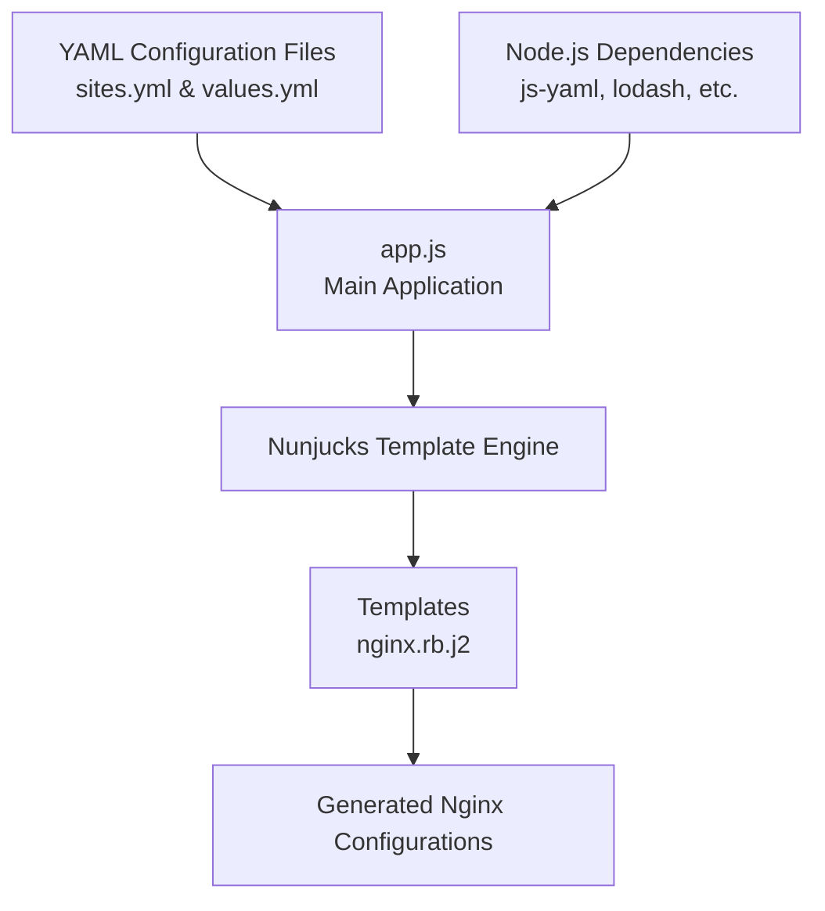

# Project Architecture Analysis: generator

## Table of Contents
- [1. Overview](#1-overview)
- [2. Project Structure](#2-project-structure)
- [3. Component Diagram](#3-component-diagram)
- [4. Data Flow](#4-data-flow)
- [5. Key Technologies](#5-key-technologies)
- [6. Design Patterns](#6-design-patterns)


## 1. Overview

This project appears to be a Nginx configuration generator that uses template-based rendering to create Nginx configuration files for multiple sites. The architecture follows a simple, modular approach where site configurations are defined in YAML files, processed through a Node.js application, and rendered using Nunjucks templates to generate the final Nginx configuration files.

The system takes site definitions and values from YAML files, processes them through a templating engine, and outputs ready-to-use Nginx configuration files, enabling efficient management of multiple web server configurations.

## 2. Project Structure

```
├── .gitignore
├── LICENSE
├── README.md
├── app.js
├── package.json
├── sites.yml
├── values.yml
└── templates/
    └── nginx.rb.j2
```

## 3. Component Diagram



## 4. Data Flow

1. **Configuration Input**:
   - Site configurations are defined in `sites.yml`
   - Global values and variables are defined in `values.yml`
   - These YAML files are read by the application

2. **Processing**:
   - `app.js` loads and parses the YAML files using `js-yaml`
   - The application processes the configuration data, potentially using `lodash` for data manipulation
   - For each site configuration, the application prepares the context for template rendering

3. **Template Rendering**:
   - The Nunjucks templating engine (`nunjucks`) takes the processed data
   - It applies this data to the template (`nginx.rb.j2`) in the templates directory
   - The template contains the structure of an Nginx configuration with placeholders for dynamic values

4. **Output Generation**:
   - The rendered templates produce complete Nginx configuration files
   - These files are written to the filesystem using `fs-extra` and `fs` modules
   - The output files are ready to be used with an Nginx web server

## 5. Key Technologies

1. **Node.js**: The runtime environment for the application.

2. **js-yaml (^3.13.1)**: A JavaScript library for parsing and stringifying YAML, used to read the configuration files.

3. **Nunjucks (^3.2.0)**: A rich and powerful templating engine for JavaScript, inspired by Jinja2. Used to render the Nginx configuration templates.

4. **Lodash (^4.17.15)**: A utility library that provides helpful functions for manipulating arrays, objects, and other data types. Used for data transformation and processing.

5. **fs-extra (^8.1.0)** and **fs (0.0.1-security)**: File system modules that extend the built-in Node.js fs module with additional functionality, used for reading templates and writing output files.

6. **path (^0.12.7)**: A Node.js module for handling and transforming file paths, used to manage file locations in the application.

7. **YAML**: Used as the configuration format for defining sites and values.

## 6. Design Patterns

1. **Template Method Pattern**: The project uses templates (nginx.rb.j2) to define the skeleton of the Nginx configuration, with specific implementations determined at runtime based on the configuration data.

2. **Configuration Object Pattern**: The application uses external configuration files (sites.yml and values.yml) to control application behavior without changing code.

3. **Factory Pattern**: The application likely acts as a factory that produces Nginx configuration files based on templates and input data.

4. **Separation of Concerns**: The project separates configuration data (YAML files), processing logic (app.js), and presentation templates (nginx.rb.j2), making the system more maintainable and flexible.

5. **Data Transformation Pipeline**: The application follows a pipeline pattern where data flows from YAML files through processing to template rendering and finally to output files.

This architecture allows for easy management of multiple Nginx configurations through a centralized system, enabling quick updates and consistent configuration across multiple sites.

---
_This documentation was generated using AI analysis and may contain inaccuracies. Please verify critical information._